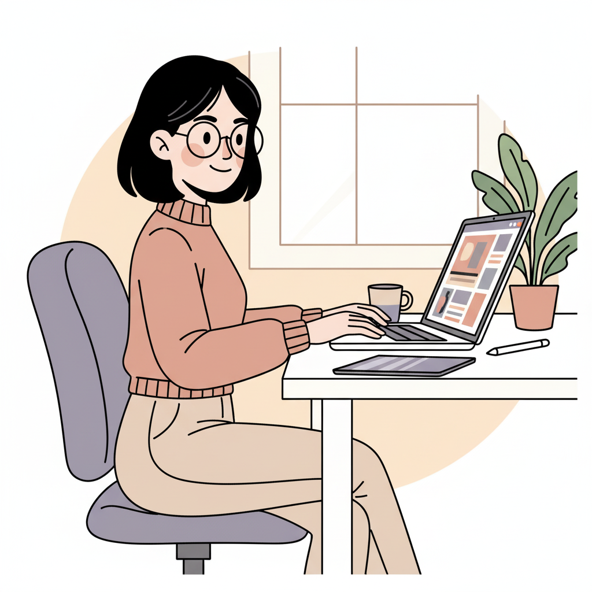

# trabajo-final

1. ¿Para qué es esta propuesta? (Objetivo general)

Crear un portafolio web profesional que presente de manera clara, atractiva y actualizada mis proyectos y capacidades como diseñadora, con el fin de facilitar oportunidades laborales, colaboraciones creativas y visibilidad profesional.

2. ¿Para quien es esta propuesta?
- UUSUARIO EXTREMO 1

Demografía

Programador joven, muy orientado a la funcionalidad y la eficiencia. No le interesa mucho el diseño, pero sí la estructura y el rendimiento del sitio.
߉ Vive en Santiago
모 Trabaja como programador junior en startup tecnológica
Intereses: código limpio, rendimiento, automatización, software libre
“Un sitio bien hecho es el que carga rápido y no se rompe.”

Creencias y comportamientos

Revisa portafolios con una mirada técnica. Se fija en la optimización, la arquitectura del sitio y si tiene un código ordenado (cuando puede verlo). No valora tanto las animaciones ni la estética mientras todo funcione perfecto.

Necesidades y metas

Ver claridad técnica y estructura sólida. Confirmar que el sitio está optimizado y responde rápido. Sentir que es un portafolio profesional desde lo funcional.

- USUARIO EXTREMO 2

 
 Demografía

Gerente de marketing de una empresa mediana, enfocado en branding, estrategia y comunicación clara. Busca coherencia visual y mensajes potentes.
߉ Vive en Las Condes
모 Trabaja liderando equipos de marketing
Intereses: marcas fuertes, claridad de storytelling, métricas, experiencias memorables
“La primera impresión lo es todo.”

Creencias y comportamientos

Revisa portafolios buscando consistencia visual, narrativa clara y propuestas bien posicionadas. Le interesa entender rápidamente tu valor profesional y cómo te comunicas. Se fija en la estética pero también en la claridad estratégica del contenido.

Necesidades y metas

Conocer tu propuesta de valor en pocos segundos. Ver proyectos presentados con intención estratégica. Determinar si tu estilo es coherente y profesional para posibles colaboraciones.

- USUARIO PROMEDIO
 (imagen generada con ia)
Demografía

Diseñadora o reclutadora creativa que revisa portafolios con frecuencia para evaluar talento. Busca claridad y profesionalismo.
߉ Vive en Providencia
모 Trabaja en estudio de diseño o área de comunicaciones
Intereses: diseño gráfico, UX/UI, branding, proyectos claros y bien explicados
“Un buen portafolio es el que me deja entender rápido lo que haces.”

Creencias y comportamientos

Visita muchos portafolios al día. Valora una estructura limpia, navegación rápida y proyectos bien narrados. Le importa ver roles, procesos y resultados sin perder tiempo buscando.

Necesidades y metas

Identificar de inmediato tu estilo y tus capacidades. Revisar tus proyectos de manera ordenada. Evaluar si calzas con un puesto, práctica o colaboración profesional.
